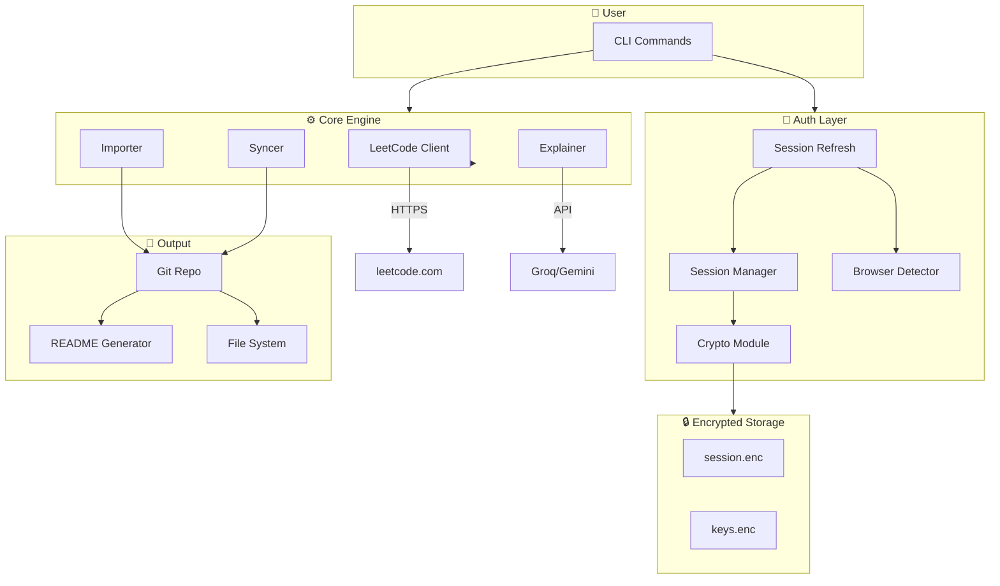
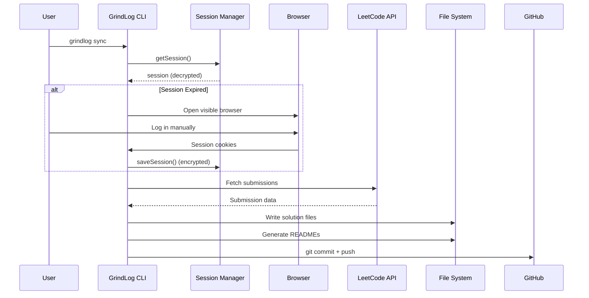
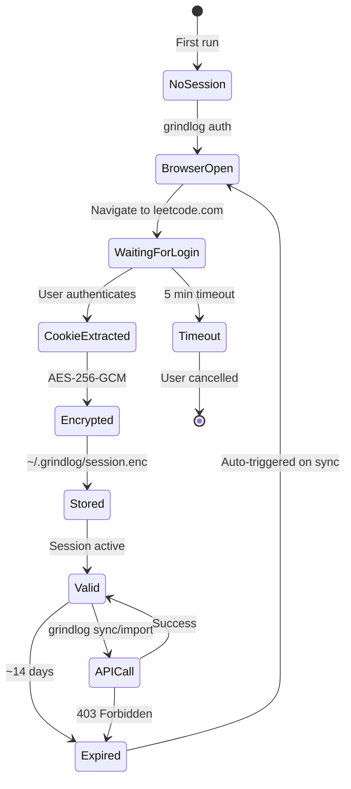
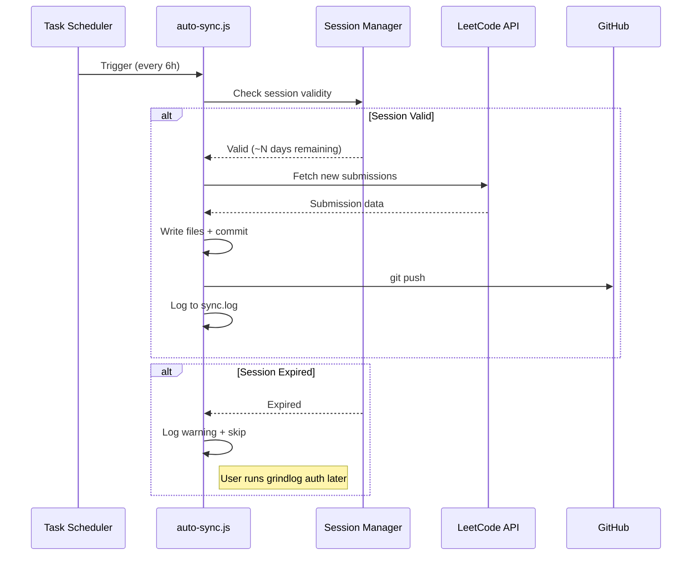

# 📖 GrindLog — Project Documentation

Detailed architecture documentation for developers, contributors, and anyone interested in understanding how GrindLog works under the hood.

---

## A. System Architecture

### High-Level Overview



### Data Flow



---

## B. Module Documentation

### `/src/auth/` — Authentication & Encryption

| File | Responsibility |
|------|---------------|
| `crypto.js` | AES-256-GCM encryption/decryption, key derivation, secure file I/O |
| `browser-detector.js` | Cross-platform browser detection (Edge, Chrome, Brave) |
| `session-manager.js` | Session lifecycle: save, load, validate, migrate, API key management |
| `session-refresh.js` | Interactive browser flow: launch, wait for auth, extract cookies |

**Key design decisions:**
- `crypto.js` uses PBKDF2 with 100K iterations for key derivation — balances security with performance
- `browser-detector.js` checks platform-specific paths — no external dependencies
- `session-manager.js` provides `migrateFromLegacyConfig()` for v1 → v2 upgrades
- `session-refresh.js` polls every 2s with a 5-minute timeout

### `/src/leetcode/` — LeetCode API Client

| File | Responsibility |
|------|---------------|
| `client.js` | GraphQL API wrapper with rate limiting and retry logic |
| `queries.js` | GraphQL query definitions (submissions, problems, profile) |
| `parser.js` | Response parsing, deduplication, topic grouping |

**Rate limiting:** 600ms between requests (configurable), exponential backoff on failure.

### `/src/sync/` — Synchronization Engine

| File | Responsibility |
|------|---------------|
| `importer.js` | Full history import (all solved problems) |
| `syncer.js` | Incremental sync (new submissions only) |
| `explain.js` | AI explanation batch generation |
| `auto-sync.js` | Standalone script for scheduled auto-sync (Windows Task Scheduler) |

**Import strategy:**
1. Fetch ALL solved problem slugs via paginated API
2. For each: fetch submission code + problem details
3. Generate AI explanation (if configured)
4. Write files organized by topic
5. Commit and push

### `/src/ai/` — AI Explanation Generation

| File | Responsibility |
|------|---------------|
| `explainer.js` | Multi-provider AI client (Groq, Gemini, OpenAI) |
| `prompts.js` | Prompt templates for explanation generation |

**Caching:** Explanations are cached in `output/.cache/explanations/` as `.md` files. Subsequent runs skip already-generated explanations.

### `/src/github/` — Git & README Generation

| File | Responsibility |
|------|---------------|
| `repo.js` | Git operations (init, commit, push, status) |
| `readme-generator.js` | Main README + per-problem README generation |

### `/src/utils/` — Utilities

| File | Responsibility |
|------|---------------|
| `config.js` | Configuration management (non-sensitive data only) |
| `file-helpers.js` | File system utilities, path construction, sanitization |
| `logger.js` | Formatted console output with colors and icons |

---

## C. Session Lifecycle



---

## C.1 Auto-Sync Architecture

GrindLog uses **Windows Task Scheduler** for automated syncing instead of GitHub Actions. This keeps all credentials local.



**Key design decisions:**
- Auto-sync **cannot** open a browser (runs in background) — if session expires, it skips gracefully
- All results logged to `sync.log` for troubleshooting
- Uses the same `syncNew()` function as manual `grindlog sync`
- `auto-sync.bat` wrapper handles the apostrophe in the directory path

---

## D. Security Deep Dive

### Encryption Architecture

```
Machine Identity
    │
    ├── os.hostname()
    ├── os.userInfo().username
    └── "grindlog-v2" (constant)
    │
    ▼
PBKDF2-SHA512 (100K iterations)
    │
    ├── Salt: ~/.grindlog/.salt (random 32 bytes, generated once)
    │
    ▼
256-bit AES Key
    │
    ▼
AES-256-GCM Encryption
    │
    ├── IV: Random 16 bytes (per encryption)
    ├── Auth Tag: 16 bytes (tamper detection)
    │
    ▼
Base64 Payload = IV + Tag + Ciphertext
    │
    ▼
Written to ~/.grindlog/session.enc
```

### Why AES-256-GCM?

| Property | Benefit |
|----------|---------|
| **Authenticated** | Detects any tampering or corruption |
| **256-bit key** | Quantum-resistant strength |
| **GCM mode** | Fast, parallelizable, widely audited |
| **Random IV** | Same plaintext produces different ciphertext each time |

### Why machine-locked keys?

The encryption key is derived from machine identity, so:
- Copying `session.enc` to another machine **cannot decrypt it**
- A different user on the same machine **cannot decrypt it**
- No master password to remember or lose

### Threat Model

| Threat | Mitigation |
|--------|-----------|
| Malware reads config.json | Config has no secrets (stripped) |
| session.enc is stolen | Cannot decrypt without same machine + user |
| Man-in-the-middle | All API calls use HTTPS |
| Rogue contributor | CI checks for secrets in config, code review required |
| Session replay | Sessions expire in ~14 days (LeetCode enforced) |

---

## E. Scalability & Future Improvements

### Planned Enhancements

1. **Plugin System** — Allow community plugins for other platforms (Codeforces, HackerRank)
2. **Cross-Platform Testing** — Automated testing on Windows, macOS, Linux
3. **Web Dashboard** — Local web UI for progress visualization
4. **Solution Diffing** — Track how your solutions improve over time
5. **Multi-Language Support** — Store solutions in multiple languages per problem
6. **Sync Conflict Resolution** — Handle edge cases when local and remote diverge
7. **Rate Limit Intelligence** — Adaptive rate limiting based on API response headers

### Architecture Improvements

- **Dependency Injection** — Make components more testable
- **Event System** — Pub/sub for sync lifecycle events
- **Config Schema Validation** — JSON Schema for config.json
- **Proper Test Suite** — Unit tests with mocking for API calls
