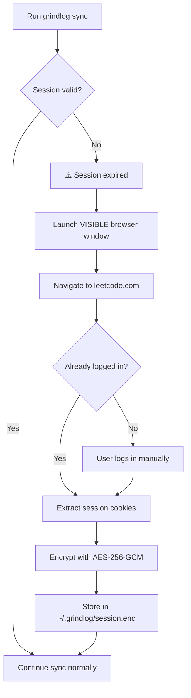

<div align="center">

# 🧠 GrindLog

### Securely automate your LeetCode → GitHub workflow

*Sync your LeetCode solutions to a beautifully structured GitHub repository — with encrypted authentication, AI explanations, and zero manual cookie copying.*


**Profile:** [D_M_Likhith](https://leetcode.com/u/D_M_Likhith/) · **Solutions:** [Leetcode_Solutions-GrindLog-s](https://github.com/likhith-gowda-7/Leetcode_Solutions-GrindLog-s)

</div>

---

## 💡 Motivation

If you grind LeetCode, you know the pain:
- Your solutions live on leetcode.com — invisible to recruiters
- Manually copying code to GitHub is tedious
- Keeping your GitHub repo organized and up-to-date is exhausting
- Session cookies expire every 2 weeks, requiring manual DevTools copy-paste

**GrindLog solves all of this.** It securely syncs your entire LeetCode history to a beautifully structured GitHub repository — with AI-generated explanations, automatic organization by topic, and **zero manual cookie management**.

---

## ✨ Features

| Feature | Description |
|---------|-------------|
| 🔑 **Interactive Session Refresh** | Authenticate via a visible browser — no more manual cookie copying |
| 🔒 **Encrypted Storage** | Sessions stored with AES-256-GCM encryption, never in plaintext |
| 🔄 **Auto-sync** | Fetch new LeetCode submissions and push to GitHub |
| 📁 **Smart Organization** | Problems organized by topic (Arrays, DP, Trees, etc.) |
| 🧠 **AI Explanations** | Auto-generated intuition, approach, and complexity analysis |
| 📊 **Beautiful READMEs** | Badges, stats, progress bars, and problem index |
| 📥 **Bulk Import** | Import your entire LeetCode history (735+ problems) in one command |
| 🩺 **Health Diagnostics** | `grindlog doctor` verifies your entire setup |
| 🏷️ **Full Metrics** | Runtime, memory, percentiles, difficulty, tags |

---

## 🔒 Security Model

GrindLog is designed to be **trustworthy** and **transparent**:

```
✅ No passwords stored          — You log in yourself in a real browser
✅ Visible browser auth         — You see and control everything
✅ Encrypted sessions           — AES-256-GCM, machine-locked
✅ Local-only storage            — Nothing leaves your machine
✅ No telemetry                 — Zero data collection
✅ No headless automation       — Browser is always visible
✅ Open source                  — Every line of code is auditable
```

> 📖 See [SECURITY.md](SECURITY.md) for the full security model, encryption details, and trust boundaries.

---

## 🚀 Quick Start

### 1. Install dependencies

```bash
npm install
```

### 2. Run setup

```bash
node src/cli.js setup
```

This will:
- Ask for your **LeetCode username**
- Open a **browser window** for you to log in (Interactive Session Refresh)
- Encrypt and store your session locally
- Configure AI explanations (optional, free with Groq)

### 3. Verify your setup

```bash
node src/cli.js doctor
```

```
  ✓ Node.js: v22.17.1
  ✓ Config file: Found
  ✓ Username: D_M_Likhith
  ✓ Session: Valid (~14 days remaining)
  ✓ Storage: Encrypted (AES-256-GCM)
  ✓ LeetCode API: Connected (737 problems solved)
  ✓ AI provider: groq (configured)
  ✓ Browser: Microsoft Edge detected

  All checks passed! GrindLog is healthy. 🎉
```

### 4. Import your history

```bash
# Test with a small batch first
node src/cli.js import --limit 10

# Then import everything
node src/cli.js import
```

---

## 📋 Commands

| Command | Description |
|---------|-------------|
| `grindlog setup` | Interactive configuration wizard |
| `grindlog auth` | Interactive Session Refresh (browser-based) |
| `grindlog auth --force` | Force re-authentication |
| `grindlog auth --clear` | Clear stored sessions |
| `grindlog doctor` | System health diagnostics |
| `grindlog stats` | Show your LeetCode progress |
| `grindlog import` | Bulk import ALL past submissions |
| `grindlog import --dry-run` | Preview import without writing files |
| `grindlog import --limit 10` | Import only 10 problems (for testing) |
| `grindlog sync` | Sync new submissions since last sync |
| `grindlog sync --push` | Sync and push to GitHub |
| `grindlog explain` | Add AI explanations to all solutions |

---

## 🔑 How Session Refresh Works

No more DevTools → Cookies → copy-paste! GrindLog handles it automatically:



**You authenticate once. GrindLog remembers for ~14 days. When it expires, it opens a browser automatically.**

---

## 🤖 AI Explanations

GrindLog generates rich explanations for every solution using **Groq** (100% free, no billing risk).

Each explanation includes:
- **Intuition** — Why the approach works
- **Approach** — Step-by-step algorithm
- **Time & Space Complexity** — With justification
- **Key Insight** — The "aha" moment

Supported providers: **Groq** (recommended), Gemini, OpenAI

---

## 📁 Output Structure

```
Leetcode_Solutions-GrindLog-s/
├── README.md                           # Auto-generated stats + heatmap + badges
├── Arrays/
│   ├── 0001-Two-Sum/
│   │   ├── README.md                   # Description + AI explanation
│   │   └── solution.py                 # Your accepted code
│   └── 0053-Maximum-Subarray/
│       ├── README.md
│       └── solution.py
├── Dynamic-Programming/
│   └── 0121-Best-Time-to-Buy-and-Sell-Stock/
│       ├── README.md
│       └── solution.py
└── Trees/
    └── ...
```

---

## 🛠️ Tech Stack

| Category | Technology | Purpose |
|----------|-----------|---------|
| **Core** | Node.js | Runtime |
| **Automation** | Puppeteer Core | Interactive Session Refresh |
| **Security** | Node.js Crypto | AES-256-GCM encryption |
| **API** | LeetCode GraphQL | Fetch submissions & problem data |
| **AI** | Groq (Llama 3.1) | Solution explanations (free) |
| **Storage** | Encrypted local files | Session & key management |
| **Git** | simple-git | Repository operations |
| **CLI** | Commander.js | Command-line interface |
| **CI/CD** | GitHub Actions | Code quality checks |

---

## 🗺️ Roadmap

- [ ] Multi-platform support (Codeforces, HackerRank)
- [ ] Plugin system for custom exporters
- [ ] Web dashboard for progress visualization
- [ ] Automatic README theme customization
- [ ] Solution diff tracking (track improvement over time)

---

## 🤝 Contributing

Contributions are welcome! Please read [CONTRIBUTING.md](CONTRIBUTING.md) for guidelines.

**Important:** GrindLog has strict security requirements. All contributions must follow the security guidelines documented in [SECURITY.md](SECURITY.md).

---

## ⚖️ Ethical Usage

GrindLog is designed for developers to:
- ✅ Sync their **own** LeetCode solutions
- ✅ Build their **personal** coding portfolio
- ✅ Automate their **own** workflow

GrindLog is **not** for:
- ❌ Accessing others' accounts
- ❌ Automated code submission
- ❌ Large-scale scraping
- ❌ Violating any platform's Terms of Service

---

## 📄 License

MIT — See [LICENSE](LICENSE) for details.
